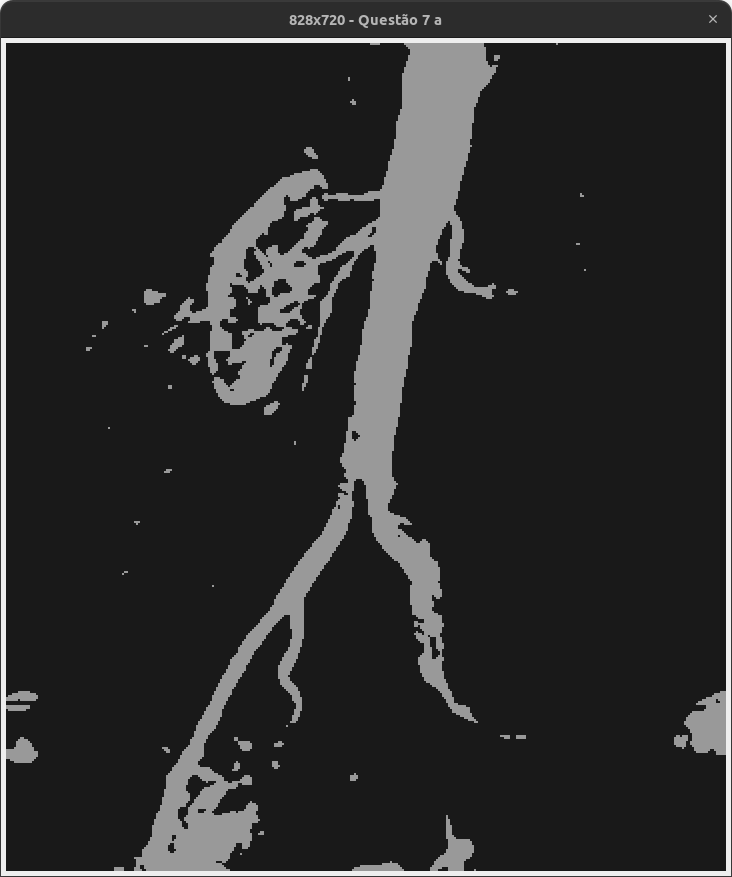
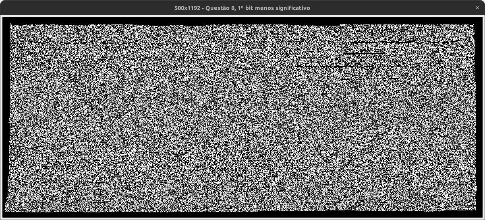
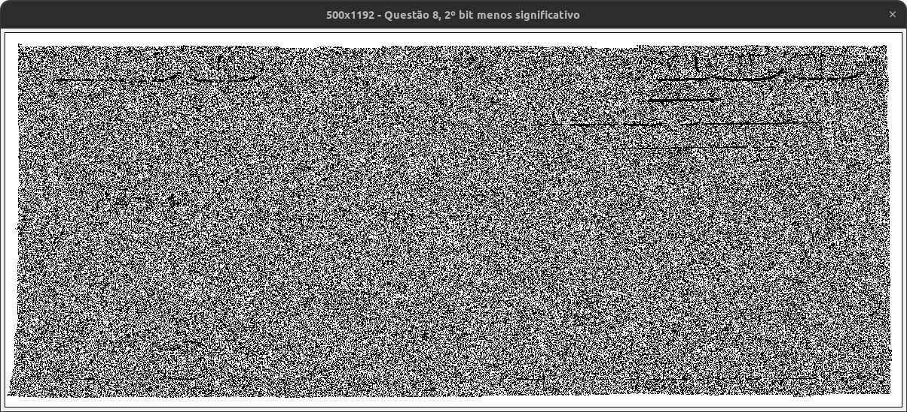
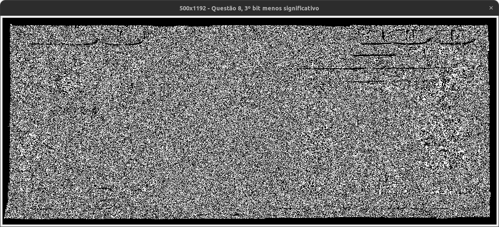
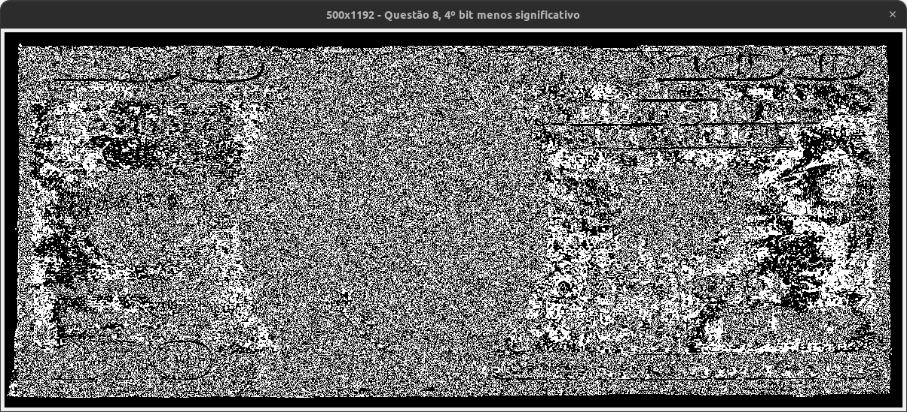
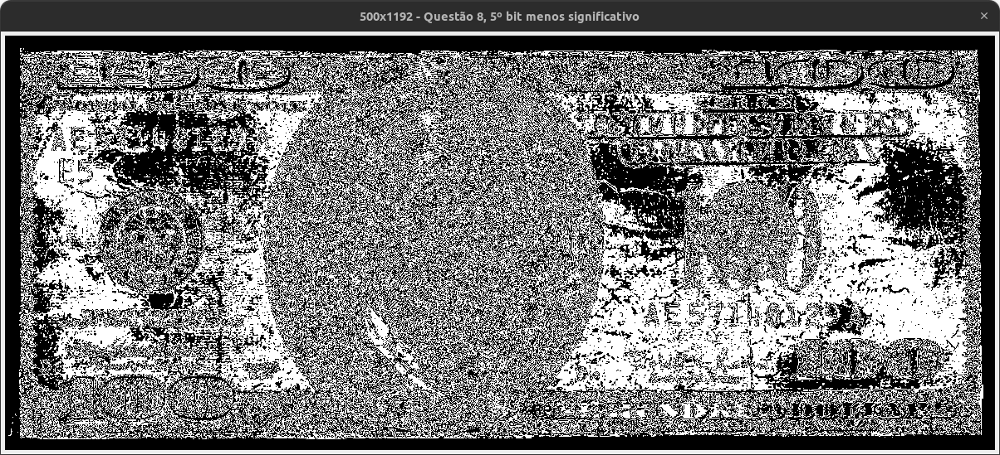
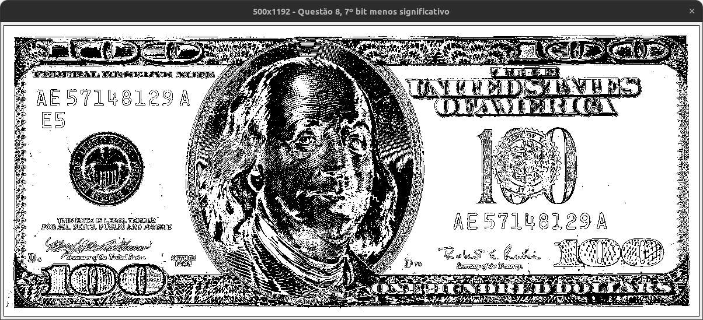
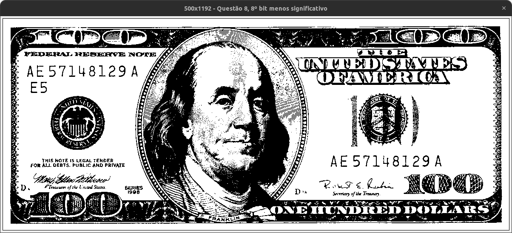

#### Universidade Federal do Agreste de Pernambuco
#### Bacharelado em Ciências da Computação
#### Prof. Tiago Buarque A. de Carvalho
---
## Reconhecimento de Padrões
### Transformações de Intensidade
### Processamento de Imagem Digital
### Aluno: Vinícius Santos de Almeida
---

- 1\.
  - Nesta questão foi necessário criar um método para buscar todos os tons de cinza diferentes, a quantidade de tons de cinza se torna o `F` da fórmula de cálculo do negativo `(F - 1 - f)`. Após isso, criei o método `imagemNegativa`, que busca os tons de cinza com a `tonsCinza`, pega o tamanho da `Array` e cria a nova imagem a partir da fórmula. Após realizar as operações, com o cálculo possui apenas subtrações, é possível que alguns valores tenham ficado abaixo de 0, por isso, usei a correção de escala, cheguei a usar `Math.max` para resolver o problema, mas a imagem ficou mais "acizentada" desta forma. Por isso, deixei a correção de escala.
  - Tecnicamente a imagem só teve as cores invertidas mesmo, porém talez ao olho humano e pelo ponto de vista do médico talvez facilite a visualização dos detalhes. Pelo fator de facilidade de impressão definitivamente é melhor.
  - Saída:
    
  - Implementação:
    ```java
    import java.util.ArrayList;

    public class Questao1 {
      
      public static void main(String args[]) {

        int[][] img = ImagemDigital.carregarImagem("./static/imagens/Fig0304(a)(breast_digital_Xray).png");
        int[][] result = imagemNegativa(img);
        result = correcaoEscala(result);

        ImagemDigital.plotarImagem(result, "Imagem negativa");
      }

      static int[][] imagemNegativa(int[][] img) {
        if (img.length <= 0 || img[0].length <= 0) return null;

        ArrayList<Integer> tonsCinza = tonsCinza(img);
        int[][] result = new int[img.length][img[0].length];
        for (int i = 0; i < img.length; i++) {
          for (int j = 0; j < img[i].length; j++) {
            result[i][j] = tonsCinza.size() - 1 - img[i][j];
          }
        }

        return result;
      }

      static ArrayList<Integer> tonsCinza(int[][] img) {
        ArrayList<Integer> tonsCinza = new ArrayList<Integer>();

        for (int i = 0; i < img.length; i++) {
          for (int j = 0; j < img[i].length; j++) {
            if (!tonsCinza.contains(img[i][j])) tonsCinza.add(img[i][j]);
          }
        }

        return tonsCinza;
      }

      static int max(int[][] img) {
        ArrayList<Integer> tonsCinza = tonsCinza(img);
        int max = 0;

        for (int i = 0; i < tonsCinza.size(); i++) {
          if (tonsCinza.get(i) > max) max = tonsCinza.get(i);
        }

        return max;
      }

      static int min(int[][] img) {
        ArrayList<Integer> tonsCinza = tonsCinza(img);
        int min = 255;

        for (int i = 0; i < tonsCinza.size(); i++) {
          if (tonsCinza.get(i) < min) min = tonsCinza.get(i);
        }

        return min;
      }

      static int[][] correcaoEscala(int[][] img) {
        if (img.length <= 0 || img[0].length <= 0) return null;

        int max = max(img);
        int min = min(img);
        int[][] result = new int[img.length][img[0].length];
        for (int i = 0; i < img.length; i++) {
          for (int j = 0; j < img[i].length; j++) {
            result[i][j] = 255 * (img[i][j] - min) / (max - min);
          }
        }

        return result;
      }
    }
    ```
- 2\. 
  - Nesta questão criei dois novos métodos, o primeiro `getC` usa o método `tonsCinza` da questão anterior e calcula o valor de `c` a partir da fórmula `(L - 1)^(1 - gama)`, onde L é o número de tons de cinza diferentes. Após obter `c`, na segunda função, `transformGama`, usei a `getC` para fazer a transformação de gama na imagem, com a fórmula `s = cr^gama`, e retornei a nova imagem, no `main` eu roda a função `transformGama` para os 3 valores de gama pedidos.
  - Quanto a diferença entre os resultados, achei muito pequena, porém notável, é possível perceber que quando o gama é menor, é possível ver alguns detalhes antes não visíveis na imagem original, porém a imagem se torna mais ruidoza.
  - Saídas:
    - Gama = 0.6: 
    - Gama = 0.5: 
    - Gama = 0.4: 
  - Implementação:
    ```java
    import java.util.ArrayList;
    import java.lang.Math;

    public class Questao2 {
      
      public static void main(String args[]) {

        int[][] img = ImagemDigital.carregarImagem("./static/imagens/Fig0308(a)(fractured_spine).png");
        double[] gamas = {0.6, 0.5, 0.4};
        for (int i = 0; i < gamas.length; i++) {
          int[][] result = transformGama(img, gamas[i]);
          ImagemDigital.plotarImagem(result, "Transformação gama: " + gamas[i]);

        }
      }

      static int[][] transformGama(int[][] img, double gama) {
        if (img.length <= 0 || img[0].length <= 0) return null;

        double c = getC(img, gama);
        int[][] result = new int[img.length][img[0].length];
        for (int i = 0; i < img.length; i++) {
          for (int j = 0; j < img[i].length; j++) {
            result[i][j] = (int) (c * Math.pow(img[i][j], gama));
          }
        }

        return result;
      }

      static double getC(int[][] img, double gama) {
        ArrayList<Integer> tonsCinza = Questao1.tonsCinza(img);

        return Math.pow((tonsCinza.size() - 1), (1 - gama));
      }
    }
    ```
- 3\. 
  - Nesta questão criei dois novos métodos, o `getC` que calcula a constante a partir da fórmula `L - 1 / log(L)`, onde `L` é a quantidade de tons de cinza diferentes. E o método `transformLog` que usando o `getC` retorna a nova imagem, pela fórmula `c * log(1 + r)`. Em ambos os métodos, adicionei o parâmetro `logBase`, que permite realizar a operação em diferentes bases de log.
  - Os resultados obtidos têm uma saturação mais altas no detalhes, porém, até mesmo com a base do log baixa (0.4), ainda houve muita granuação na imagem.
  - Saídas:
    - Base = 0.6: 
    - Base = 0.5: 
    - Base = 0.4: 
  - Implementação:
    ```java
    import java.util.ArrayList;
    import java.lang.Math;

    public class Questao3 {
      
      public static void main(String args[]) {

        int[][] img = ImagemDigital.carregarImagem("./static/imagens/Fig0308(a)(fractured_spine).png");
        double[] gamas =  {0.6, 0.5, 0.4};
        for (int i = 0; i < gamas.length; i++) {
          int[][] result = transformLog(img, gamas[i]);
          ImagemDigital.plotarImagem(result, "Transformação log: " + gamas[i]);

        }
      }

      static int[][] transformLog(int[][] img, double logBase) {
        if (img.length <= 0 || img[0].length <= 0) return null;

        double c = getC(img, logBase);
        int[][] result = new int[img.length][img[0].length];
        for (int i = 0; i < img.length; i++) {
          for (int j = 0; j < img[i].length; j++) {
            result[i][j] = (int) (c * (Math.log(1 + img[i][j]) / Math.log(logBase)));
          }
        }

        return result;
      }

      static double getC(int[][] img, double logBase) {
        ArrayList<Integer> tonsCinza = Questao1.tonsCinza(img);

        return (tonsCinza.size() - 1) / (Math.log(tonsCinza.size()) / Math.log(logBase));
      }
    }
    ```
-4\. 
  - Nesta questão apenas ajustei o código da questão 2, alterando os valores de gama e adicionando a correção de escala após processar as imagens, devido aos altos valores de gama foi necessária essa correção.
  - O que pude observar é uma grande diferença no constraste da imagem, permitindo uma melhor visualização de alguns detalhes que antes não poderiam ser visto, assim como um melhoramento em geral da imagem, que deixou de ser esbranquiçada. No gama = 3, já houve uma grande melhora, porém a saturação ainda é muito alta no horizonte da imagem, já no gama = 4, houve uma melhora significativa que parece ser o melhor equilibrio, a saturação no horizonte é menor, e o contraste nas áreas de matas da cidade e casas é visível, no último caso, gama = 5, a saturação foi ainda mais melhorada no horizonte, em contrapartida, as casas e a mata ao redor da cidades perdeu contraste, perdendo alguns detalhes.
  - Saídas:
    - Gama = 3: 
    - Gama = 4: 
    - Gama = 5: 
  - Implementação (apenas o que mudou da questão 2 para a questão 4):
    ```java
    public static void main(String args[]) {

      int[][] img = ImagemDigital.carregarImagem("./static/imagens/Fig0309(a)(washed_out_aerial_image).png");
      double[] gamas = {3, 4, 5};
      for (int i = 0; i < gamas.length; i++) {
        int[][] result = transformGama(img, gamas[i]);
        result = Questao1.correcaoEscala(result);
        ImagemDigital.plotarImagem(result, "Transformação gama: " + gamas[i]);

      }
    }
    ```
- 5\. 
  - Aqui fiz ajustes no código da questão 2 para adicionar suporte a imagens coloridas. Tentei alguns valores de gama e selecionei os que achei mais intessantes entre os experimentados: 0.5, 2, 5.
  - No gama = 0.5, a imagem ganhou contraste na região dos tetos das casa, isso também adicionou granulação, pessoalmente, não achei um resultado agradável, mas pode ser útil para perceber alguns detalhes que não eram visíveis antes em cima das casas.
    - 
  - No gama = 2, a imagem ganhou muito mais contraste na região do horizonte, o suficiente para invisibilizar as casas abaixo do horizonte e destacar bem as cores do sol atrás das nuvens, dessa forma, esse gama se torna útil para destacar essas cores mais claras, dando mais contraste a elas, e dimuindo o contraste na região mais escura.
    - 
  - No gama = 5, a imagem ficou quase que totalmente escura, mostrando apenas os detalhes próximos às regiões mais claras, onde fica o sol, é um resultado talvez tenha uso muito específicos, um exemplo onde imagino que seria interessante o uso de gama tão alto é em fotos de formações de pedras que forma um espaço por onde é possível ver o horizonte.
    - 
  - Usei uma imagem encontrada na internet onde achei o uso do gama = 5 seria legal, porém achei melhor o gama = 2, segue o resultado.
    - Antes: 
      - 
    - Depois (Gama = 2):
      - 
  - Implementação:
    ```java
    import java.util.ArrayList;
    import java.lang.Math;

    public class Questao5 {
      
      public static void main(String args[]) {

        int[][][] img = ImagemDigital.carregarImagemCor("./static/imagens/a4d88a27b6e6f33558a8e675b742-1458995.jpg");
        double[] gamas = {0.5, 2, 5};
        for (int i = 0; i < gamas.length; i++) {
          int[][][] result = transformGama(img, gamas[i]);
          ImagemDigital.plotarImagemCor(result, "Transformação gama: " + gamas[i]);

        }
      }

      static int[][][] transformGama(int[][][] img, double gama) {
        if (img.length <= 0 || img[0].length <= 0) return null;

        double c = getC(img, gama);
        int[][][] result = new int[img.length][img[0].length][3];
        for (int i = 0; i < img.length; i++) {
          for (int j = 0; j < img[i].length; j++) {
            for (int k = 0; k < img[i][j].length; k++) {
              result[i][j][k] = (int) (c * Math.pow(img[i][j][k], gama));
            }
          }
        }

        return result;
      }

      static double getC(int[][][] img, double gama) {
        ArrayList<Integer> tons = tons(img);

        return Math.pow((tons.size() - 1), (1 - gama));
      }

      static ArrayList<Integer> tons(int[][][] img) {
        ArrayList<Integer> tons = new ArrayList<Integer>();

        for (int i = 0; i < img.length; i++) {
          for (int j = 0; j < img[i].length; j++) {
            for (int k = 0; k < img[i][j].length; k++) {
              if (!tons.contains(img[i][j][k])) tons.add(img[i][j][k]);

            }
          }
        }

        return tons;
      }
    }
    ```
- 6\.
  - Nesta questão fiz apenas o cálculo assim como sugerido nos intervalo para letra a e letra b, assim obtive duas imagens.
  - a: Nesta imagem nota-se que houve uma melhora na imagem, no sentido que ela ficou muito menos esbranquiçada, isso aconteceu porque nos pontos intermediários, do intervalo houve mais escurecimento dos valores. Nos demais pontos também houve alteração nas cores o que também ajudou a dar contraste nos objetos da imagem.
    - 
    - Implementação:
      ```java
      public class Questao6a {

        public static void main(String args[]) {

          int[][] img = ImagemDigital.carregarImagem("./static/imagens/Fig0310(b)(washed_out_pollen_image).png");
          int[][] result = transformLinear(img);
          ImagemDigital.plotarImagem(result, "Transformação linear");
        }

        static int[][] transformLinear(int[][] img) {
          if (img.length <= 0 || img[0].length <= 0) return null;

          int[][] result = new int[img.length][img[0].length];
          for (int i = 0; i < img.length; i++) {
            for (int j = 0; j < img[i].length; j++) {
              if (img[i][j] < 64) {
                result[i][j] = (int) (img[i][j] * 0.5);
              } else if (64 <= img[i][j] && img[i][j] <= 192) {
                result[i][j] = (int) (img[i][j] * 1.5 - 65);
              } else if (img[i][j] > 192) {
                result[i][j] = (int) (img[i][j] * 0.5 + 128);
              }
            }
          }

          return result;
        }
      }
      ```
  - b: Nesta imagems houve a binarização da imagem, os pontos mais escuro, menores que 107, se tornaram pretos e os demais brancos. resultando numa imagem com pretos e brancos absolutos.
    - 
    - Implementação:
      ```java
      public class Questao6b {
        
        public static void main(String args[]) {

          int[][] img = ImagemDigital.carregarImagem("./static/imagens/Fig0310(b)(washed_out_pollen_image).png");
          int[][] result = transformLinear(img);
          ImagemDigital.plotarImagem(result, "Transformação linear");
        }

        static int[][] transformLinear(int[][] img) {
          if (img.length <= 0 || img[0].length <= 0) return null;

          int[][] result = new int[img.length][img[0].length];
          for (int i = 0; i < img.length; i++) {
            for (int j = 0; j < img[i].length; j++) {
              if (img[i][j] < 107) {
                result[i][j] = 0;
              } else if (img[i][j] >= 107) {
                result[i][j] = 255;
              }
            }
          }

          return result;
        }
      }
      ```
- 7\. 
  - Antes de fazer a implementação, defino a função `T(r)` para ambos os gráficos.
    - Gráfico 1: 
      ```
      T(r) = {  153, A <= r <= B
                25, A > r > B
      ```
    - Gráfico 2:
      ```
      T(r) = {  204, A <= r <= B
                  r, A > r > B
      ```
  - Fiz alguns ajustes no código da questão anterior, alterando os intervalos. Para obter resultados semealhantes às imagens mostradas na aula, no primeiro gráfico considerei A = 150 e B = 255, e assim pude obter a imagem a seguir:
    - 
  - Já para o segundo gráfico usei os valores de A = 150 e B = 200, e obtive a imagem a seguir:
    - 
  - Foi necessário os ajustes do intervalos a fim de destacar o objeto desejado, se eu colocasse intervalos menores, principalmente no B, eu perderia alguns detalhes do objeto que são muito claros, possivelmente até branco absoluto. No gráfico dois eu não perdi tantos detalhes mantendo o B em um valor um pouco abaixo do branco absoluto. Não consegui obter resultados iguais os da aula, não sei se isso já era esperado.
  - Implementação:
    ```java
    public class Questao7 {
  
      public static void main(String args[]) {

        int[][] img = ImagemDigital.carregarImagem("./static/imagens/Fig0312(a)(kidney).png");
        int[][] resultA = questao7a(img);
        ImagemDigital.plotarImagem(resultA, "Questão 7 a");
        int[][] resultB = questao7b(img);
        ImagemDigital.plotarImagem(resultB, "Questão 7 b");
      }

      static int[][] questao7a(int[][] img) {
        if (img.length <= 0 || img[0].length <= 0) return null;

        int[][] result = new int[img.length][img[0].length];
        for (int i = 0; i < img.length; i++) {
          for (int j = 0; j < img[i].length; j++) {
            if (150 <= img[i][j] && img[i][j] <= 255) {
              result[i][j] = 153;
            } else {
              result[i][j] = 25;
            }
          }
        }

        return result;
      }

      static int[][] questao7b(int[][] img) {
        if (img.length <= 0 || img[0].length <= 0) return null;

        int[][] result = new int[img.length][img[0].length];
        for (int i = 0; i < img.length; i++) {
          for (int j = 0; j < img[i].length; j++) {
            if (150 <= img[i][j] && img[i][j] <= 200) {
              result[i][j] = 204;
            } else {
              result[i][j] = img[i][j];
            }
          }
        }

        return result;
      }
    }
    ```
- 8\. 
  - Nessa questão, criei um novo método onde uso loops como nas outras questões, porém nesses loops coloquei uma conversão do valor de `img[i][j]` para binário e completando os 0 à esquerda, em seguida, caso o bit em questão fosse igual a 1, eu preencho na nova imagem, caso não, a posição na imagem fica com 0. No `main` coloquei um `for`, e para cada bit menos significativo é feita a chamada do novo método `fatiar` onde ele retorna a nova imagem.
  - Obtive 8 novas imagens diferentes como mostra-se a seguir:
  - 1º bit: 
  - 2º bit: 
  - 3º bit: 
  - 4º bit: 
  - 5º bit: 
  - 6º bit: 
  - 7º bit: 
  - 8º bit: 
  - Implementação:
    ```java
    import java.lang.Integer;

    public class Questao8 {
      
      public static void main(String args[]) {

        int[][] img = ImagemDigital.carregarImagem("./static/imagens/Fig0314(a)(100-dollars).png");
        int[] bits = {7,6,5,4,3,2,1,0};
        for (int i = 0; i < bits.length; i++) {
          int[][] result = fatiar(img, bits[i]);
          ImagemDigital.plotarImagem(result, "Questão 8, " + (i + 1) + "º bit menos significativo");
        }
      }

      static int[][] fatiar(int[][] img, int bit) {
        if (img.length <= 0 || img[0].length <= 0) return null;

        int[][] result = new int[img.length][img[0].length];
        for (int i = 0; i < img.length; i++) {
          for (int j = 0; j < img[i].length; j++) {
            String binary = String.format("%8s", Integer.toBinaryString(img[i][j])).replaceAll(" ", "0");
            if (binary.charAt(bit) == '1') {
              result[i][j] = img[i][j];
            }
          }
        }

        return result;
      }
    }
    ```
- 9\. 
  - Nessa questão, usei a mesma função de fatiar da questão anterior, porém fatiando apenas para os dois bits mais significativos, em seguida, usei o método que criei `combinar` que soma apenas os dois bits mais significativos multiplicados pela potencia correspondente na nova imagem.
  - Saída:
    - 
  - Implementação:
    ```java
    import java.lang.Integer;

    public class Questao9 {
      
      public static void main(String args[]) {

        int[][] img = ImagemDigital.carregarImagem("./static/imagens/Fig0314(a)(100-dollars).png");
        int[][] bit7 = fatiar(img, 1);
        int[][] bit8 = fatiar(img, 0);
        int[][] result = combinar(bit7, bit8);
        ImagemDigital.plotarImagem(result, "Questão 9");
      }

      static int[][] fatiar(int[][] img, int bit) {
        if (img.length <= 0 || img[0].length <= 0) return null;

        int[][] result = new int[img.length][img[0].length];
        for (int i = 0; i < img.length; i++) {
          for (int j = 0; j < img[i].length; j++) {
            String binary = String.format("%8s", Integer.toBinaryString(img[i][j])).replaceAll(" ", "0");
            if (binary.charAt(bit) == '1') {
              result[i][j] = img[i][j];
            }
          }
        }

        return result;
      }

      static int[][] combinar(int[][] img1, int[][] img2) {
        int[][] result = null;
        if (img1.length <= 0 || img1.length != img2.length)
          return result;
        
        result = new int[img1.length][img1[0].length];
        for (int i = 0; i < img1.length; i++) {
          for (int j = 0; j < img1[i].length; j++) {
            char binary1 = String.format("%8s", Integer.toBinaryString(img1[i][j])).replaceAll(" ", "0").charAt(1);
            char binary2 = String.format("%8s", Integer.toBinaryString(img2[i][j])).replaceAll(" ", "0").charAt(0);
            result[i][j] = (binary1=='1' ? (int) Math.pow(2, 6) : 0) + (binary2=='1' ? (int) Math.pow(2,7) : 0);
          }
        }
        return result;
      }
    }
    ```

- 10\.
  - Na letra A, optei por usar transformação de gama na imagem, com intuito de deixá-la mais clara na região da floresta, permitindo ver mais detalhes usei o gama 0.6. Segue o resultado abaixo:
    - 
  - Na letra B, tentei usar gama primeiro, porém não achei melhoria significante com nenhum valor de gama, já ao tentar negativo, achei o resultado melhor, pois consigo perceber bem os detalhes circulares da célula. Segue a imagem resultante:
    - 
  - Na letra C, decidi usar transformação gama novamente, dessa vez usei um valor maior que 1, já que minha intenção era deixar a imagem menos saturada. Usei o gama = 4. O resultado não foi totalmente satisfatório, mas não tinha muito o que fazer nas regiões da imagem onde o branco é absoluto:
    - 
  - Na letra D, tentei várias técnicas, e acabei optante pela técnica de fatiamento de níveis de intensidade na interção de ver com mais detalhes os formatos no interior do cérebro, criei a seguinte função T(r):
    ```
    T(r) = {  153, 150 <= r <= 255
                25, r < 150
    ```
    - Segue o resultado: 
  - Implementação das 4 letras:
    ```java
    public class Questao10 {
  
      public static void main(String args[]) {

        double gama = .6;
        int[][][] img = ImagemDigital.carregarImagemCor("./static/imagens/Floresta.png");
        int[][][] floresta = Questao5.transformGama(img, gama);
        ImagemDigital.plotarImagemCor(floresta, "Floresta, gama: " + gama);
        
        int[][] img2 = ImagemDigital.carregarImagem("./static/imagens/Celula.png");
        int[][] celula = Questao1.imagemNegativa(img2);
        celula = Questao1.correcaoEscala(celula);
        ImagemDigital.plotarImagem(celula, "Celula, negativa");

        gama = 4;
        int[][][] img3 = ImagemDigital.carregarImagemCor("./static/imagens/GorisRaioni.jpg");
        img3 = Questao5.transformGama(img3, gama);
        ImagemDigital.plotarImagemCor(img3, "GorisRaioni, gama: " + gama);

        int[][] img4 = ImagemDigital.carregarImagem("./static/imagens/CВrebro.png");
        img4 = intervalo(img4);
        img4 = Questao1.correcaoEscala(img4);
        ImagemDigital.plotarImagem(img4, "Cérebro, gama: " + gama);
      }

      static int[][] intervalo(int[][] img) {
        if (img.length <= 0 || img[0].length <= 0) return null;

        int[][] result = new int[img.length][img[0].length];
        for (int i = 0; i < img.length; i++) {
          for (int j = 0; j < img[i].length; j++) {
            if (150 <= img[i][j] && img[i][j] <= 255) {
              result[i][j] = 153;
            } else if (img[i][j] < 150) {
              result[i][j] = 25;
            }
          }
        }

        return result;
      }
    }
    ```