#### Universidade Federal do Agreste de Pernambuco
#### Bacharelado em Ciências da Computação
#### Prof. Tiago Buarque A. de Carvalho
---
## Aprendizagem de Máquina:
### Exercícios sobre Agrupamento
### Aluno: Vinícius Santos de Almeida
---
- 1\. a)
    - Nessa questão, percorri um array que compõe cada valor de K, e em cada iteração fiz o calculo rodei o `KMeans` com 10 iterações, gerando o vetor de y predito, em seguida percorro cada grupo gerado e associo em cada y predito naquele grupo a classe real do índice, ao finalizar para todos os Ks, formato as arrays para criação dos gráficos.
    - A saída foi feita em imagens .png que foram anexas a seguir:
        - 
        - 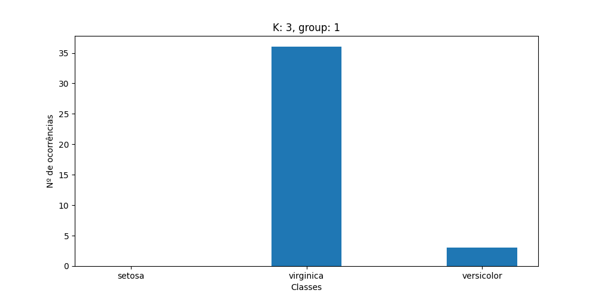
        - 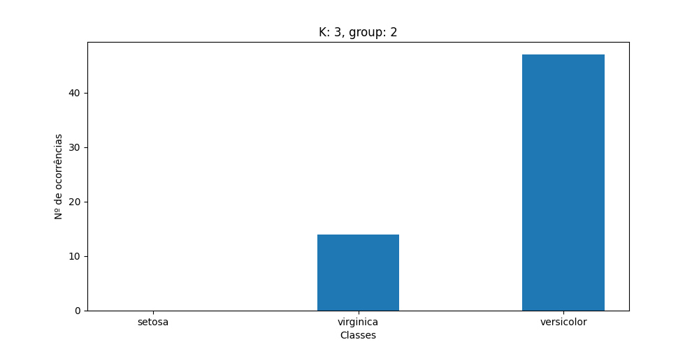
        - 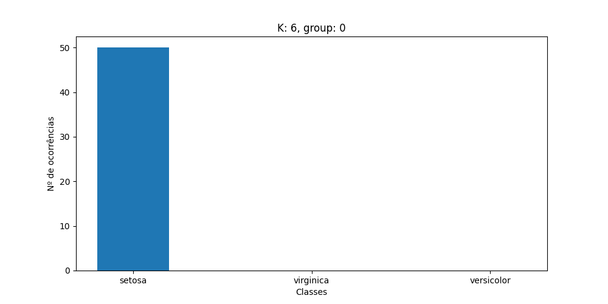
        - 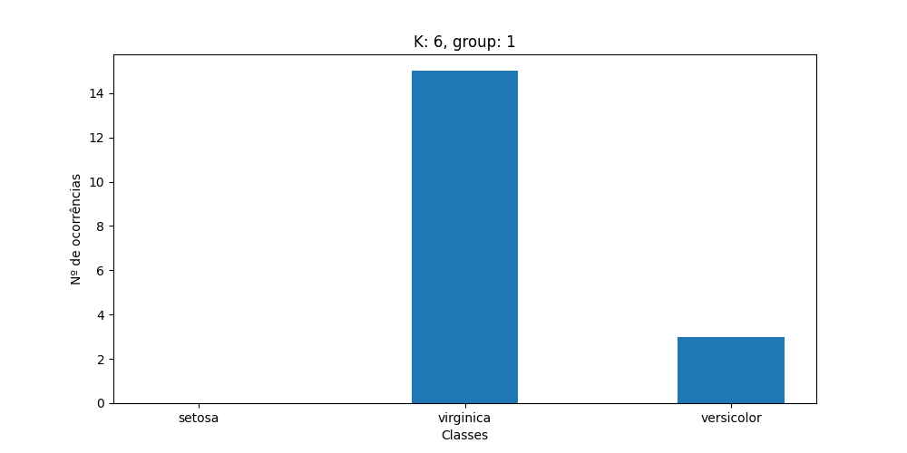
        - 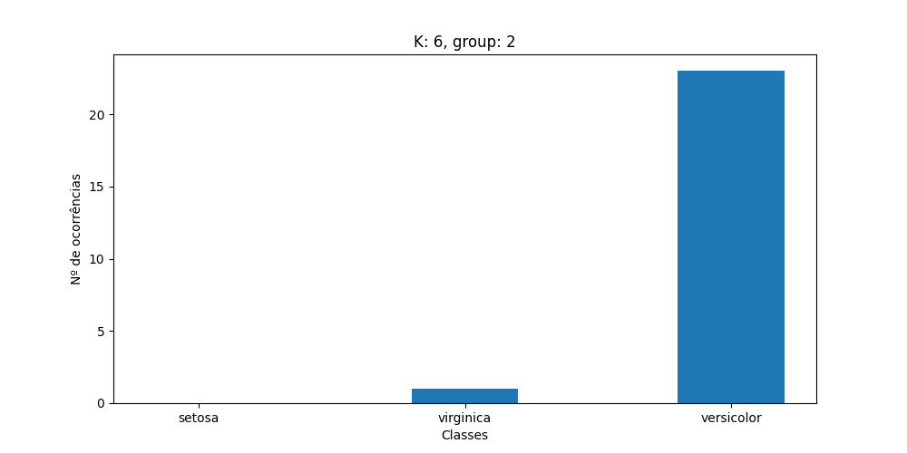
        - 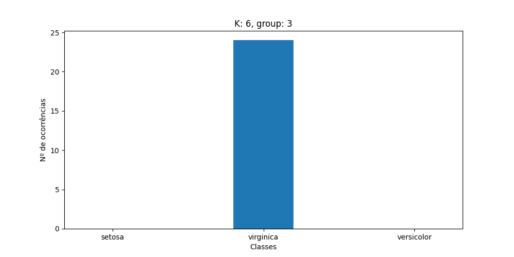
        - 
        - 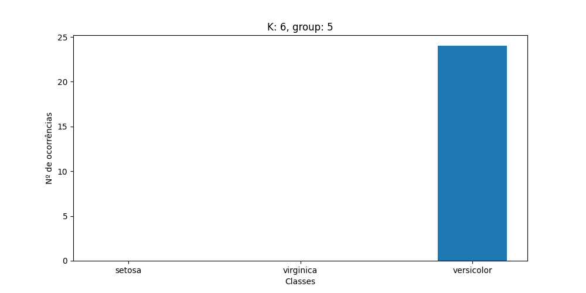
        - 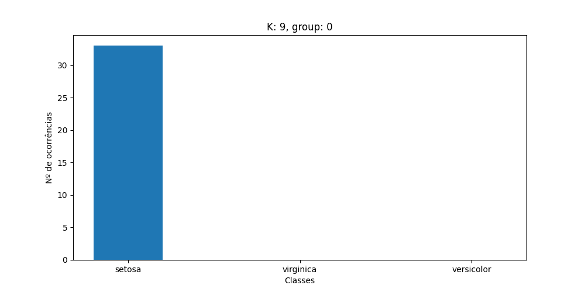
        - 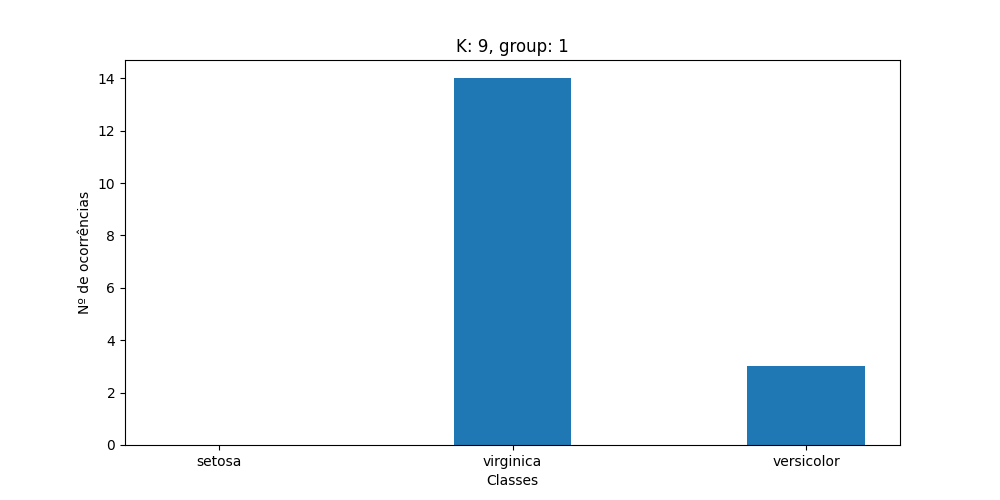
        - 
        - 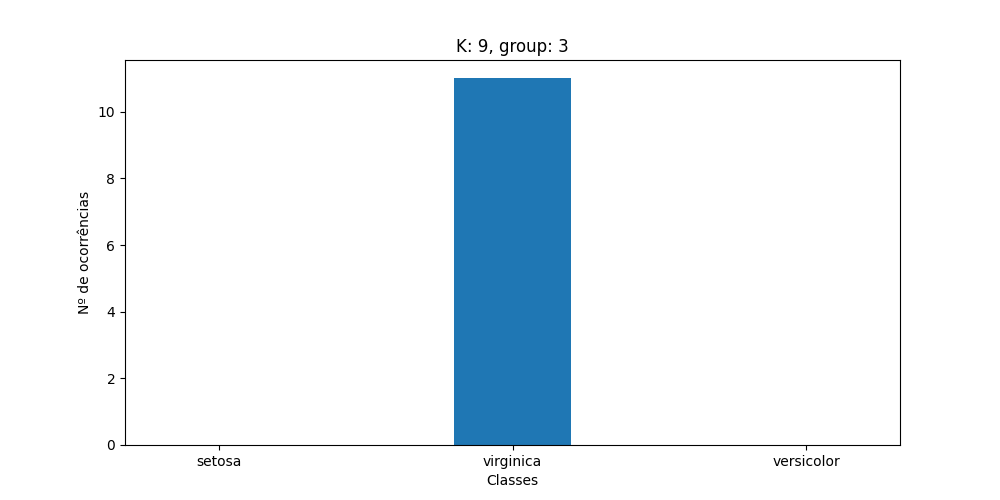
        - 
        - 
        - 
        - 
        - 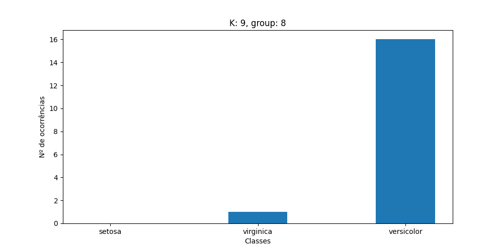
    - Implementação:
        ```python
        import matplotlib.pyplot as plt
        from math import sqrt
        import numpy as np
        from utils import load_data

        from sklearn.cluster import KMeans

        def distancia_euclidiana(treino, teste):
            soma = 0
            if len(treino) == len(teste):
                for i in range(len(treino) - 1):
                    soma += ((float(treino[i]) - float(teste[i])) ** 2)
                    

            return sqrt(soma)

        data, _ = load_data('./data/iris.csv', sep=',')
        X = np.array([[float(v) for k,v in row.items() if k != 'class'] for row in data])
        y_real = np.array([next(v for k,v in row.items() if k == 'class') for row in data])


        clusters = [3, 6, 9]
        for k in clusters:
            kmeans = KMeans(
                n_clusters=k,
                n_init=1,
                max_iter=10,
                random_state=1,
            )

            y_predicted = kmeans.fit_predict(X)
            centroids = kmeans.cluster_centers_
            groups = {i:[] for i, _ in enumerate(centroids)}
            for centroid_i, _ in enumerate(centroids):
                for y_index, y in enumerate(y_predicted):
                    if centroid_i == y:
                        groups[centroid_i].append(y_real[y_index])

            for k_group, group in groups.items():
                group = np.array(group)
                unique, counts = np.unique(group, return_counts=True)

                setosa = None
                virginica = None
                versicolor = None
                for i, v in enumerate(unique):
                    if v == 'setosa':
                        setosa = counts[i]
                    if v == 'virginica':
                        virginica = counts[i]
                    if v == 'versicolor':
                        versicolor = counts[i]

                classes = ['setosa', 'virginica', 'versicolor']
                fig = plt.figure(figsize=(10,5))

                plt.bar(classes, [
                    setosa if setosa else 0,
                    virginica if virginica else 0,
                    versicolor if versicolor else 0
                ], width=0.4)
                plt.xlabel('Classes')
                plt.ylabel('Nº de ocorrências')
                plt.title(f'K: {k}, group: {k_group}')
                plt.savefig(f'questao_1_a_k-{k}_group-{k_group}.png')

        ```
- 1\. b)
    - Para fazer essa questão foi necessário iterar 10 vezes em cada iteração criando uma nova instância da classe `KMeans` da biblioteca `sklearn`, em cada nova instância o número máximo de iterações é zero e os centróides iniciais são os centróides da iteração anterior, exceto na primeira iteração que são gerados aleatoriamente.
    - Segue as tabelas de média e desvio padrão assim como retornado na saída:
        - Tabela de médias:
        
        |    i    |   3    |   6   |   9   |
        |---|---|---|---|
        | 1 | 2.19 | 2.315 | 2.309 |
        | 2 | 2.199 | 2.292 | 2.3 |
        | 3 | 2.204 | 2.295 | 2.304 |
        | 4 | 2.212 | 2.295 | 2.304 |
        | 5 | 2.225 | 2.295 | 2.304 |
        | 6 | 2.239 | 2.295 | 2.304 |
        | 7 | 2.256 | 2.295 | 2.304 |
        | 8 | 2.27 | 2.295 | 2.304 |
        | 9 | 2.285 | 2.295 | 2.304 |
        | 10 | 2.292 | 2.295 | 2.304 |

        - Tabela de desvios:

        |    i    |   3    |   6   |   9   |
        |---|---|---|---|
        | 1 | 1.48 | 1.584 | 1.54 |
        | 2 | 1.505 | 1.574 | 1.541 |
        | 3 | 1.518 | 1.576 | 1.545 |
        | 4 | 1.53 | 1.576 | 1.545 |
        | 5 | 1.545 | 1.576 | 1.545 |
        | 6 | 1.556 | 1.576 | 1.545 |
        | 7 | 1.567 | 1.576 | 1.545 |
        | 8 | 1.576 | 1.576 | 1.545 |
        | 9 | 1.586 | 1.576 | 1.545 |
        | 10 | 1.589 | 1.576 | 1.545 |

    - Segue a implementação:
        ```python
        import matplotlib.pyplot as plt
        from math import sqrt
        import numpy as np
        from utils import load_data

        from sklearn.cluster import KMeans

        def distancia_euclidiana(treino, teste):
            soma = 0
            if len(treino) == len(teste):
                for i in range(len(treino) - 1):
                    soma += ((float(treino[i]) - float(teste[i])) ** 2)
                    

            return sqrt(soma)

        data, _ = load_data('./data/iris.csv', sep=',')
        X = np.array([[float(v) for k,v in row.items() if k != 'class'] for row in data])


        clusters = [3, 6, 9]
        medias = {
            3: [],
            6: [],
            9: []
        }
        desvios = {
            3: [],
            6: [],
            9: []
        }
        for k in clusters:
            centroids = None
            iterations = 10
            for i in range(iterations):
                kmeans = KMeans(
                    n_clusters=k,
                    n_init=1,
                    max_iter=1,
                    random_state=1,
                    init=centroids if centroids is not None else 'k-means++'
                )
                kmeans.fit(X)
                centroids = kmeans.cluster_centers_

                distancias = []
                for row in X:
                    for centroid in kmeans.cluster_centers_:
                        distancias.append(distancia_euclidiana(row, centroid))

                distancias = np.array(distancias)
                medias[k].append(round(np.average(distancias), 3))
                desvios[k].append(round(distancias.std(), 3))

        print('>>>> Tabela de médias <<<<')
        print('|i|3|6|9|')
        print('|-|-|-|-|')
        for index, _ in enumerate(medias[3]):
            print(f'| {index + 1} | {medias[3][index]} | {medias[6][index]} | {medias[9][index]} |')

        print('>>>> Tabela de desvios <<<<')
        print('|i|3|6|9|')
        print('|-|-|-|-|')
        for index, _ in enumerate(desvios[3]):
            print(f'| {index + 1} | {desvios[3][index]} | {desvios[6][index]} | {desvios[9][index]} |')

        ```
- 1\. c)
    - A implementação foi feita, porém ao testar a questão 1. b usando a minha implementação, percebe-se que há muitos casos em que o algoritmo agrupa em apenas alguns grupos e não todos, acredito que isso se dá pelo vetor de centróides aleatório com o qual começa a cada tentativa, a biblioteca usada na questão anterior deve oferecer melhores centróides que os meus aleatórios.
    - Segue abaixo a saída de agrupamento para cada k em [3,6,9] na base íris com 10 iterações:
        - `k=3`:
            ```
            [0, 0, 0, 0, 0, 0, 0, 0, 0, 0, 0, 0, 0, 0, 0, 0, 0, 0, 0, 0, 0, 0, 0, 0, 0, 0, 0, 0, 0, 0, 0, 0, 0, 0, 0, 0, 0, 0, 0, 0, 0, 0, 0, 0, 0, 0, 0, 0, 0, 0, 2, 1, 2, 1, 1, 1, 1, 1, 1, 1, 1, 1, 1, 1, 1, 1, 1, 1, 1, 1, 1, 1, 1, 1, 1, 1, 2, 2, 1, 1, 1, 1, 1, 1, 1, 1, 1, 1, 1, 1, 1, 1, 1, 1, 1, 1, 1, 1, 1, 1, 2, 1, 2, 2, 2, 2, 1, 2, 2, 2, 2, 2, 2, 1, 1, 2, 2, 2, 2, 1, 2, 1, 2, 1, 2, 2, 1, 1, 2, 2, 2, 2, 2, 1, 2, 2, 2, 2, 1, 2, 2, 2, 1, 2, 2, 2, 1, 2, 2, 1]
            ```
        - `k=6`
            ```
            [2, 2, 2, 2, 2, 2, 2, 2, 2, 2, 2, 2, 2, 2, 2, 2, 2, 2, 2, 2, 2, 2, 2, 2, 2, 2, 2, 2, 2, 2, 2, 2, 2, 2, 2, 2, 2, 2, 2, 2, 2, 2, 2, 2, 2, 2, 2, 2, 2, 2, 3, 3, 3, 4, 3, 4, 3, 4, 3, 4, 4, 4, 4, 3, 4, 3, 4, 4, 3, 4, 3, 4, 3, 3, 3, 3, 3, 3, 3, 4, 4, 4, 4, 3, 4, 3, 3, 3, 4, 4, 4, 3, 4, 4, 4, 4, 4, 3, 4, 4, 0, 3, 0, 3, 0, 0, 4, 0, 0, 0, 3, 3, 0, 3, 3, 3, 3, 0, 0, 3, 0, 3, 0, 3, 0, 0, 3, 3, 3, 0, 0, 0, 3, 3, 3, 0, 3, 3, 3, 0, 0, 3, 3, 0, 0, 3, 3, 3, 3, 3]
            ```
        - `k=9`
            ```
            [1, 1, 1, 1, 1, 1, 1, 1, 1, 1, 1, 1, 1, 1, 1, 1, 1, 1, 1, 1, 1, 1, 1, 1, 1, 1, 1, 1, 1, 1, 1, 1, 1, 1, 1, 1, 1, 1, 1, 1, 1, 1, 1, 1, 1, 1, 1, 1, 1, 1, 6, 5, 6, 5, 5, 5, 5, 5, 5, 5, 5, 5, 5, 5, 5, 5, 5, 5, 5, 5, 5, 5, 5, 5, 5, 5, 6, 6, 5, 5, 5, 5, 5, 5, 5, 5, 5, 5, 5, 5, 5, 5, 5, 5, 5, 5, 5, 5, 5, 5, 6, 5, 6, 6, 6, 6, 5, 6, 6, 6, 6, 6, 6, 5, 5, 6, 6, 6, 6, 5, 6, 5, 6, 5, 6, 6, 5, 5, 6, 6, 6, 6, 6, 5, 6, 6, 6, 6, 5, 6, 6, 6, 5, 6, 6, 6, 5, 6, 6, 5]
            ```
    - Segue abaixo a implementação:
        ```python
        import matplotlib.pyplot as plt
        import random
        import numpy as np

        from math import sqrt
        from utils import load_data

        UNDEFINED = (99999, None)

        def distancia_euclidiana(treino, teste):
            soma = 0
            if len(treino) == len(teste):
                for i in range(len(treino) - 1):
                    soma += ((float(treino[i]) - float(teste[i])) ** 2)
                    
            return sqrt(soma)

        class KMedias():

            def __init__(self, X: list, k: int, i: int = 10,) -> None:
                self.X= X
                self.i = i

                self.k = k
                self.n_columns = len(self.X[0]) if self.X else 0

            def gen_random_centroids(self) -> None:
                self.centroids = []
                for _ in range(self.k):
                    self.centroids.append([random.uniform(0,10) for _ in range(self.n_columns)])

            def gen_undefined_out(self) -> list:
                return [UNDEFINED for _ in range(len(self.X))]

            def update_centroids(self):
                groups = [[] for _ in range(self.k)]
                for y, x in zip(self.y_predict, self.X):
                    for i in range(self.k):
                        if y[1] == i:
                            groups[i].append(x)

                for i_group, group in enumerate(groups):
                    for i_col, _ in enumerate(group[0] if group else []):
                        col_values = [next(v for i, v in enumerate(row) if i == i_col) for row in group]
                        self.centroids[i_group][i_col] = np.average(np.array(col_values))

            def predict(self, init: list = None) -> list:
                centroid = None
                self.y_predict = self.gen_undefined_out()

                if init:
                    self.centroids = init
                else:
                    self.gen_random_centroids()

                for _ in range(self.i):
                    new_group = True
                    while (new_group):
                        new_group = False
                        for i_x, x in enumerate(self.X):
                            min = UNDEFINED
                            for i_centroid, centroid in enumerate(self.centroids):
                                distance = distancia_euclidiana(x, centroid)
                                if distance < min[0]:
                                    min = (distance, i_centroid)
                            if self.y_predict[i_x] != min:
                                new_group = True
                                self.y_predict[i_x] = min

                    self.update_centroids()

                return [group for distance, group in self.y_predict]


        data, _ = load_data('./data/iris.csv', sep=',')
        X = [[float(v) for k,v in row.items() if k != 'class'] for row in data]
        y_real = [next(v for k,v in row.items() if k == 'class') for row in data]

        kmedias = KMedias(X, 3, 10)
        print(kmedias.predict(init=None))
        ```