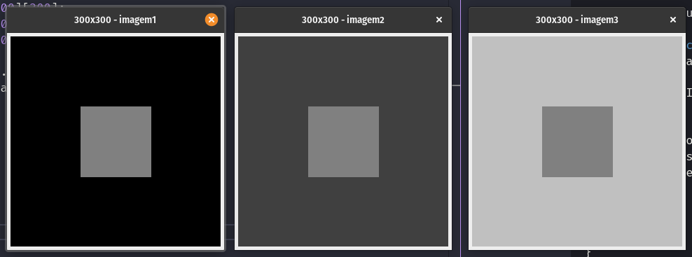
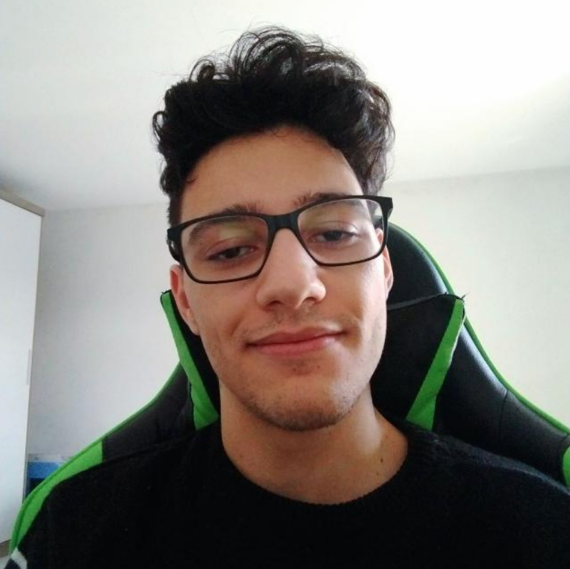
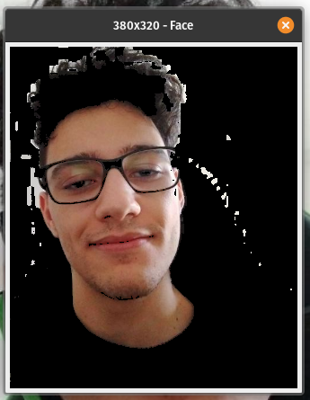
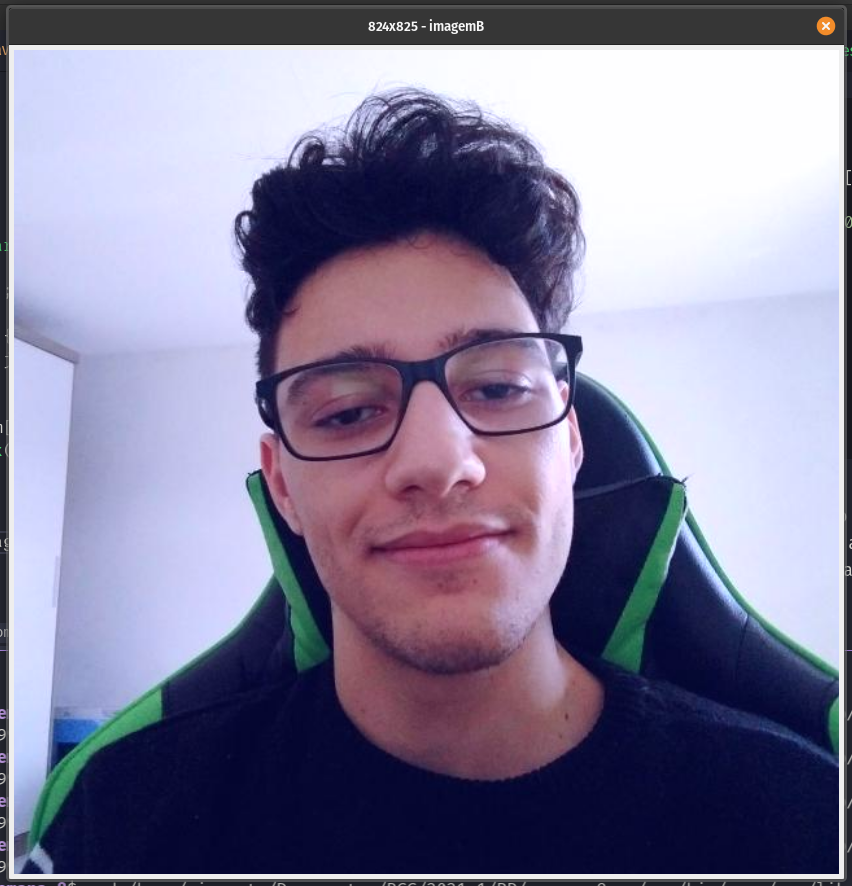
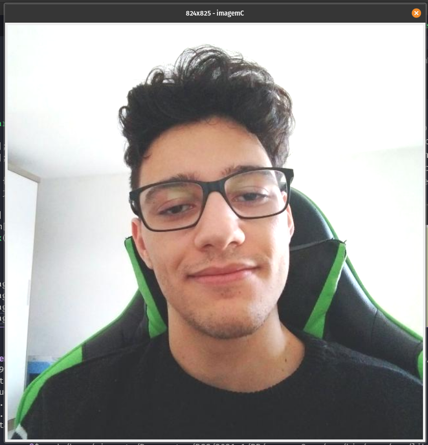
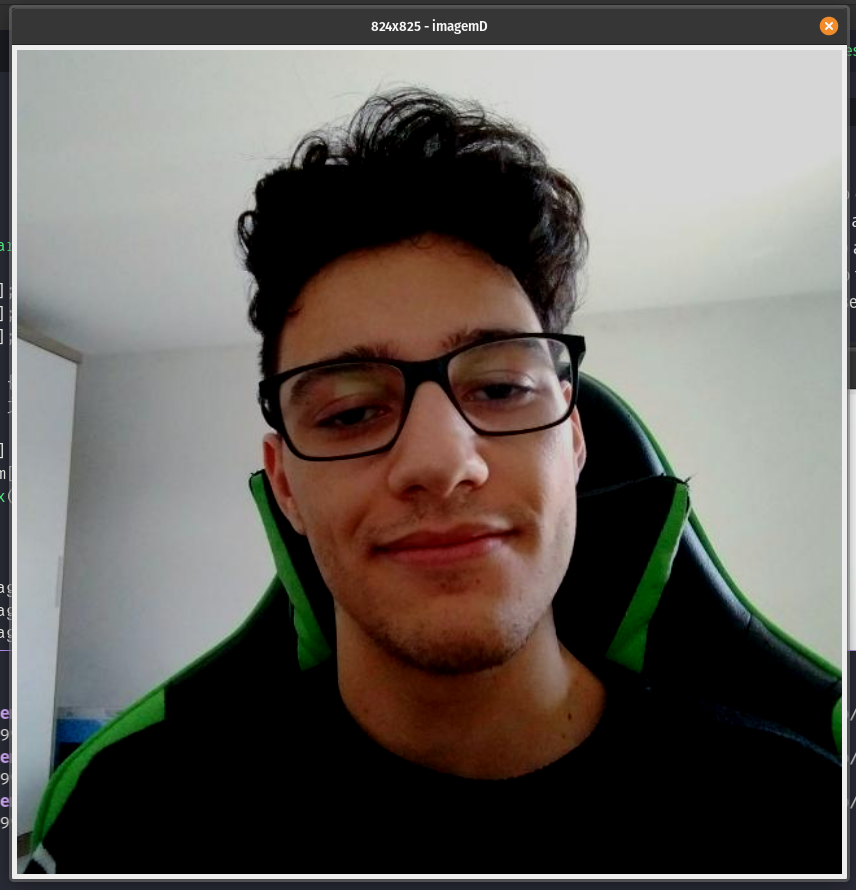
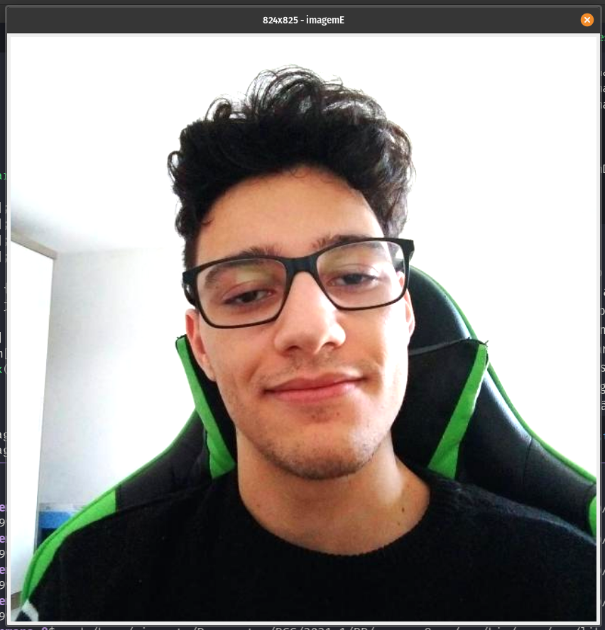
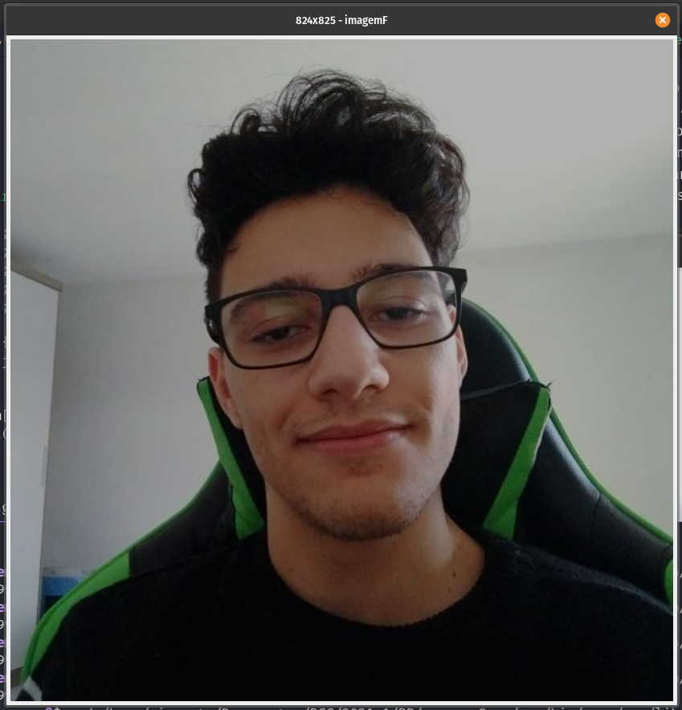

#### Universidade Federal do Agreste de Pernambuco
#### Bacharelado em Ciências da Computação
#### Prof. Tiago Buarque A. de Carvalho
---
## Reconhecimento de Padrões
### Exercícios da Semana 01 − Introdução
### Processamento de Imagem Digital
### Aluno: Vinícius Santos de Almeida

- 1\. 
  - Nessa questão carreguei a imagem usando a classe fornecida `ImagemDigital` e foi bem simples criar o laço duplo com `for`, usei uma `ArrayList` para armazenor os valores e usei o método `contains()` para verificar se cada valor encontrado já existe na lista, caso não exista, então é um valor distinto, então adiciona à lista. A saída, mostrada abaixo, comprova que os retângulos da imagem de fato possuem intensidade constante:
    ```java
    32
    64
    96
    128
    160
    192
    ```
  - A implementação ficou como mostrado a seguir:
    ```java
    import java.util.ArrayList;

    public class Questao1 {
      
      public static void main(String args[]) {
        int[][] imagem = ImagemDigital.carregarImagem("./static/figura1.png");

        ArrayList<Integer> novosPixeis = new ArrayList<Integer>();
        for (int i = 0; i < imagem.length; i++) {
          for (int j = 0; j < imagem[i].length; j++) {
            if (!novosPixeis.contains(imagem[i][j])) {
              novosPixeis.add(imagem[i][j]);
              System.out.println(imagem[i][j]);
            }
          }
        }
      }
    }
    ```
- 2\. 
  - Foi nessário gerar três vetores de duas dimensões de 300 x 300 de tamanho, cada um representando uma figura, em seguida, percorri um dos vetores fazendo a verificação se `j < 100` ou `j > 200` ou `i < 100` ou `i > 200` então deveria colorir os três vetores na posição `[i][j]`, cada vetor diferente com uma das 3 cores 0, 64, e 192, no `else` eu colori o quadrado do meio, sempre 128, dessa forma, todos os quadrados do meio de fato têm a mesma cor.
  - Saída:
    - 
  - Implementação:
    ```java
    public class Questao2 {
  
      public static void main(String args[]) {
        int[][] imagemGerada1 = new int[300][300];
        int[][] imagemGerada2 = new int[300][300];
        int[][] imagemGerada3 = new int[300][300];

        for (int i = 0; i < imagemGerada1.length; i++) {
          for (int j = 0; j < imagemGerada1[i].length; j++) {
            if (j < 100 || j > 200 || i < 100 || i > 200) {
              imagemGerada1[i][j] = 0;
              imagemGerada2[i][j] = 64;
              imagemGerada3[i][j] = 192;
            } else {
              imagemGerada1[i][j] = 128;
              imagemGerada2[i][j] = 128;
              imagemGerada3[i][j] = 128;
            }
          }
        }

        ImagemDigital.plotarImagem(imagemGerada1, "imagem1");
        ImagemDigital.plotarImagem(imagemGerada2, "imagem2");
        ImagemDigital.plotarImagem(imagemGerada3, "imagem3");
      }
    }
    ```
- 3\. a)
  - Nessa questão, após carregar a minha imagem, criei um novo vetor 3 x 3 para colocar a imagem gerada da face. Para isso percorro cada linha e coluna da imagem, e onde o indice `[i][j][0]` for maior que `[i][j][1]` e `[i][j][0]` for maior que `[i][j][2]` é salvo o valor de `[i][j]` em face, dividindo os valores de i e j por 2 em cada para escalar e imagem menor, além disso, subtraio alguns valores ainda de i e j para tentar posicionar a face o mais perto da origem possível sem perder informações, também adiciono mais algumas condições no `if` para tentar remover o cabelo da imagem da face, esses dois últimos fiz na tentativa e erro. Segue abaixo a entrada e saída:
    - Entrada: 
    - Saída: 
    - Implementação:
      ```java
      import java.math.*;

      public class Questao3 {

        public static void main(String args[]) {
          int[][][] imagem = ImagemDigital.carregarImagemCor("./static/eu.png");
          int[][][] face = new int[320][380][3];

          for (int i = 0; i < imagem.length; i++) {
            for (int j = 0; j < imagem[i].length; j++) {
              if (
                (imagem[i][j][0] > imagem[i][j][1] && imagem[i][j][0] > imagem[i][j][2])
                && (imagem[i][j][0] > 20 && imagem[i][j][1] > 20 && imagem[i][j][2] > 20)) {
                face[Math.max(0, i/2-90)][Math.max(0, j/2-30)] = imagem[i][j];
              }
            }
          }

          ImagemDigital.plotarImagemCor(imagem, "Eu");
          ImagemDigital.plotarImagemCor(face, "Face");
        }
      }
      ```
- 3\. b) 
  - Usei o código da questão anterior, criando um novo vetor para representar a imagem azulada e fazendo ajustes no loop, atribuo ao novo vetor todos os valores encontrados na imagem original em suas mesma posições, porém somando 40 ao valor do indice `[i][j][2]` para ficar notável que foi adicionado mais azul à imagem.
  - Saída:
    
  - Implementação (partes adicionadas ao `main()` e aos `for`):
    ```java
    public static void main(String args[]) {
      ...
      int[][][] imagemB = new int[825][824][3];

      for (int i = 0; i < imagem.length; i++) {
        for (int j = 0; j < imagem[i].length; j++) {
          ...
          imagemB[i][j][0] = imagem[i][j][0];
          imagemB[i][j][1] = imagem[i][j][1];
          imagemB[i][j][2] = Math.min(255, imagem[i][j][2] + 40);
        }
      }
      ...
      ImagemDigital.plotarImagemCor(imagemB, "imagemB");

    }
    ```
- 3\. c) 
  - Usei o código da questão anterior, criando um novo vetor para representar a nova imagem e fazendo ajustes no loop, atribuo ao novo vetor todos os valores encontrados na imagem original em suas mesma posições, porém somando 40 ao valor do indice de todos os canais. Eu esperava que a imagem ficasse mais esbranquiçada, o que de fato aconteceu no final, pois como adicionou mais cor em todos os canais, significa que estou adicionando branco à imagem, ou mais saturação. É possível notar isso bem no fundo, que já era em tons de cinza claro, e agora ficou branco total em muitas regiões.
  - Saída:
    
  - Implementação (partes adicionadas ao `main()` e aos `for`):
    ```java
    public static void main(String args[]) {
      ...
      int[][][] imagemC = new int[825][824][3];

      for (int i = 0; i < imagem.length; i++) {
        for (int j = 0; j < imagem[i].length; j++) {
          ...
          imagemC[i][j][0] = Math.min(255, imagem[i][j][0] + 40);
          imagemC[i][j][1] = Math.min(255, imagem[i][j][1] + 40);
          imagemC[i][j][2] = Math.min(255, imagem[i][j][2] + 40);
        }
      }
      ...
      ImagemDigital.plotarImagemCor(imagemC, "imagemC");

    }
    ```

- 3\. d) 
  - Usei o código da questão anterior, criando um novo vetor para representar a nova imagem e fazendo ajustes no loop, atribuo ao novo vetor todos os valores encontrados na imagem original em suas mesma posições, porém somando -40 ao valor do indice de todos os canais. Eu esperava que a imagem ficasse mais escura, o que de fato aconteceu no final, pois como estou removendo cor em todos os canais, significa que estou removendo branco da imagem, ou seja, adiciona mais ruído, menos saturação. É possível notar isso muito bem no cabelo e na roupa que já eram escuros ficarem totalmente pretos.
  - Saída:
    
  - Implementação (partes adicionadas ao `main()` e aos `for`):
    ```java
    public static void main(String args[]) {
      ...
      int[][][] imagemD = new int[825][824][3];

      for (int i = 0; i < imagem.length; i++) {
        for (int j = 0; j < imagem[i].length; j++) {
          ...
          imagemD[i][j][0] = Math.max(0, imagem[i][j][0] + (-40));
          imagemD[i][j][1] = Math.max(0, imagem[i][j][1] + (-40));
          imagemD[i][j][2] = Math.max(0, imagem[i][j][2] + (-40));
        }
      }
      ...
      ImagemDigital.plotarImagemCor(imagemD, "imagemD");

    }
    ```
- 3\. e) 
  - Usei o código da questão anterior, criando um novo vetor para representar a nova imagem e fazendo ajustes no loop, atribuo ao novo vetor todos os valores encontrados na imagem original em suas mesma posições, porém multiplicando por 1.3, que foi o valor que me fez notar bem a diferença da imagem. O resultado esperado era que a saturação aumentasse muito onde já era alta, e pouco nos demais pontos, e foi o que realmente aconteceu, é possível notar, por exemplo, que na bochecha direita onde a luz reflete a saturação ficou no máximo, porém em outros pontos do rosto onde a luz não reflete tanto que a saturação aumentou pouco.
  - Saída:
    
  - Implementação (partes adicionadas ao `main()` e aos `for`):
    ```java
    public static void main(String args[]) {
      ...
      int[][][] imagemE = new int[825][824][3];

      for (int i = 0; i < imagem.length; i++) {
        for (int j = 0; j < imagem[i].length; j++) {
          ...
          imagemE[i][j][0] = Math.min(255, (int) (imagem[i][j][0] * 1.3));
          imagemE[i][j][1] = Math.min(255, (int) (imagem[i][j][1] * 1.3));
          imagemE[i][j][2] = Math.min(255, (int) (imagem[i][j][2] * 1.3));
        }
      }
      ...
      ImagemDigital.plotarImagemCor(imagemE, "imagemE");

    }
    ```
- 3\. f) 
  - Usei o código da questão anterior, criando um novo vetor para representar a nova imagem e fazendo ajustes no loop, atribuo ao novo vetor todos os valores encontrados na imagem original em suas mesma posições, porém multiplicando por 0.7, que foi o valor que me fez notar bem a diferença da imagem. O resultado esperado era que a saturação diminuisse mais significativamente nos mesmo pontos que na letra anterior aumentou e foi o que realmente aconteceu, é possível notar, por exemplo, que na bochecha direita onde a luz reflete a saturação ficou diminuiu o que a deixou cinza, porém em outros pontos do rosto onde a luz não reflete tanto que a saturação diminuiu pouco.
  - Saída:
    
  - Implementação (partes adicionadas ao `main()` e aos `for`):
    ```java
    public static void main(String args[]) {
      ...
      int[][][] imagemF = new int[825][824][3];

      for (int i = 0; i < imagem.length; i++) {
        for (int j = 0; j < imagem[i].length; j++) {
          ...
          imagemF[i][j][0] = Math.min(255, (int) (imagem[i][j][0] * 0.7));
          imagemF[i][j][1] = Math.min(255, (int) (imagem[i][j][1] * 0.7));
          imagemF[i][j][2] = Math.min(255, (int) (imagem[i][j][2] * 0.7));
        }
      }
      ...
      ImagemDigital.plotarImagemCor(imagemF, "imagemF");

    }
    ```