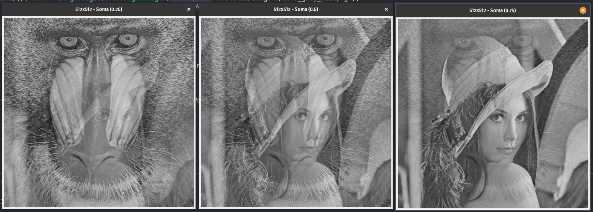
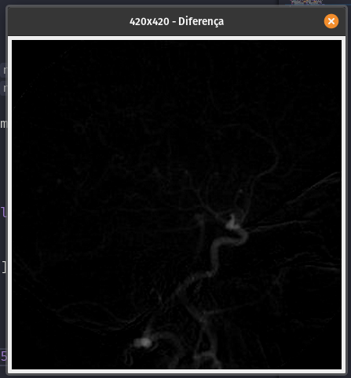
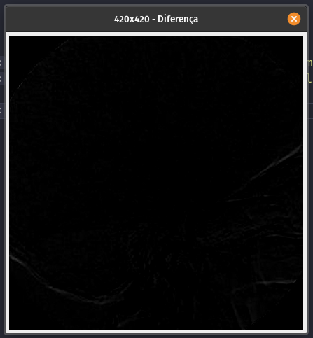
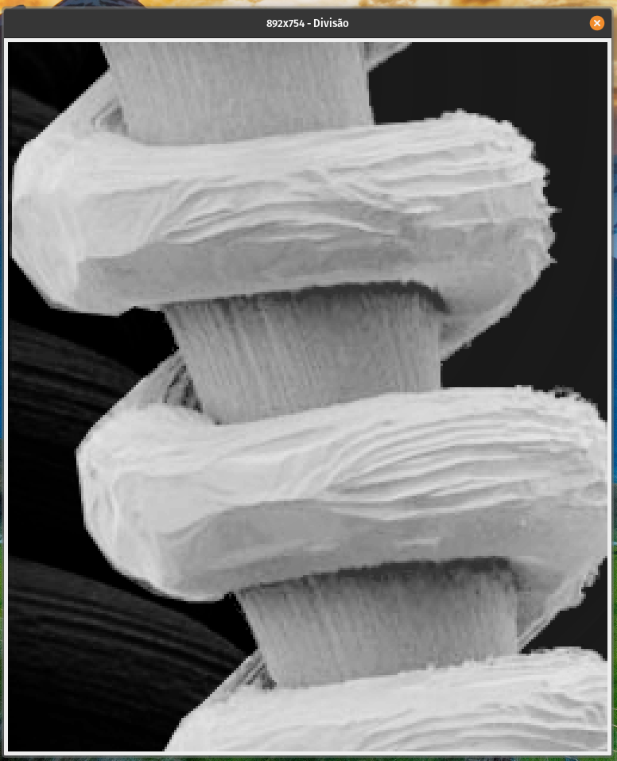
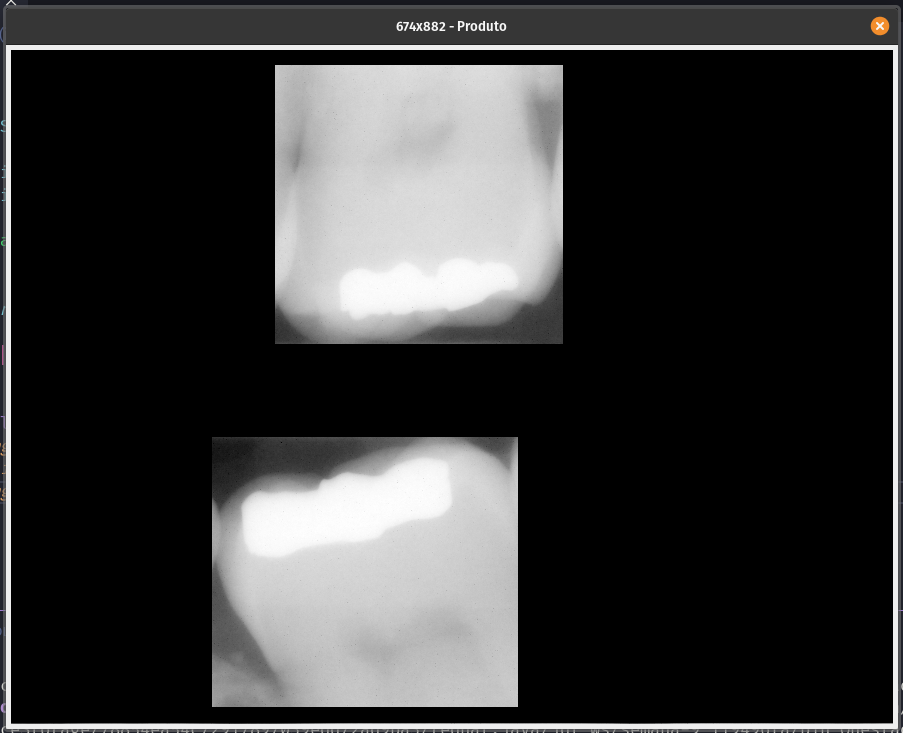
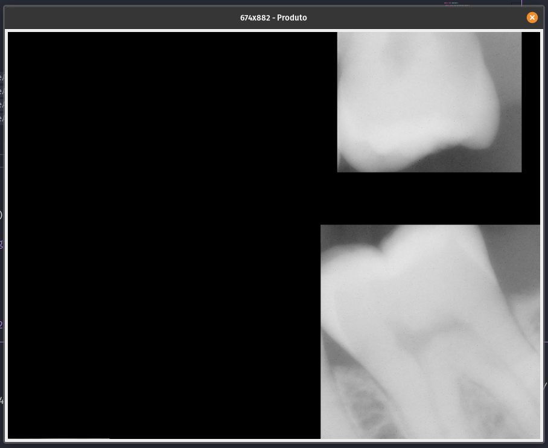
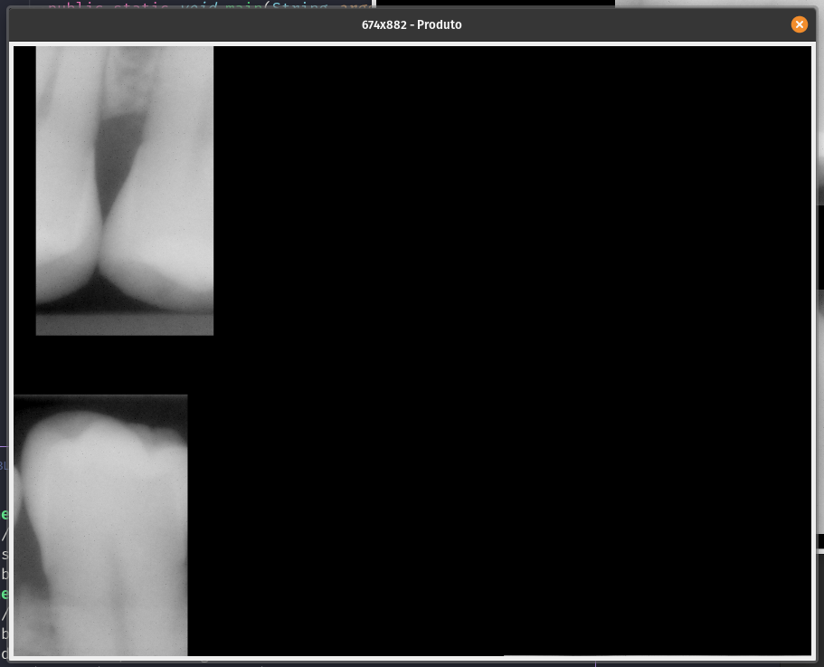
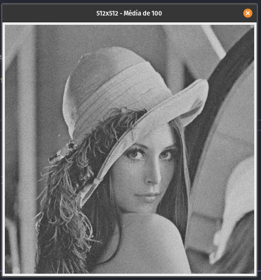
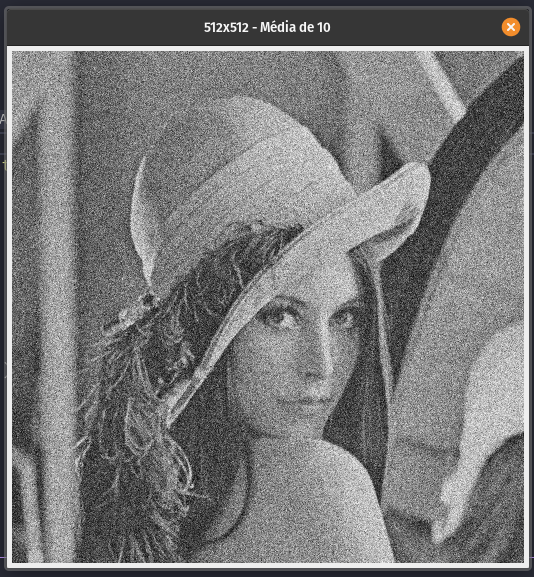

#### Universidade Federal do Agreste de Pernambuco
#### Bacharelado em Ciências da Computação
#### Prof. Tiago Buarque A. de Carvalho
---
## Reconhecimento de Padrões
### Operações Básicas
### Processamento de Imagem Digital
### Aluno: Vinícius Santos de Almeida
---

- 1\.
  - Nessa primeira questão, usei `Java` e a classe fornecida `ImagemDigital`. Criei um método chamado `somaPonderada` que recebe as duas imagens (`int[][] img1, int[][] img2`) e o valor de alfa e retorna a imagem resultante. Como é possível notar pelas saídas abaixo, a prevalência de uma imagem sobre a outra dependerá do valor de alfa, onde 0 seria prevalecendo 0% da imagem `img1`, ou seja, mostrando apenas a imagem `img2` e 100% prevalecendo 100% da imagem `img1`, desta forma, mostrando totalmente a imagem `img1`. Por isso, a imagem do mandril é mais visível quando alfa é 0.25, pois só há 25% da imagem de lena na imagem. Já em 0.75 prevalece lena.
    
  - Implementação:
    ```java
    public class Questao1 {
      
      public static void main(String args[]) {

        int[][] lena = ImagemDigital.carregarImagem("./static/imagens/lena_gray_512.png");
        int[][] mandril = ImagemDigital.carregarImagem("./static/imagens/mandril_gray.png");

        float[] alphas = { 0.25F, 0.50F, 0.75F };
        for (float alpha : alphas) {
          ImagemDigital.plotarImagem(somaPonderada(lena, mandril, alpha), "Soma ("+alpha+")");
        }
      }

      static int[][] somaPonderada(int[][] img1, int[][] img2, float alpha) {
        int[][] result = null;
        if (img1.length <= 0 || img1.length != img2.length)
          return result;
        
        result = new int[img1.length][img1[0].length];
        for (int i = 0; i < img1.length; i++) {
          for (int j = 0; j < img1[i].length; j++) {
            result[i][j] = (int) (alpha * img1[i][j] + (1 - alpha) * img2[i][j]);
          }
        }
        return result;
      }
    }
    ```
- 2\. 
  - Continuando usando Java e a classe `ImagemDigital`, utilizei parte do código da questão anterior, apenas retirando o alfa e alterando o cálculo para a simples diferença de uma imagem por outra, em seguida fiz um `if` que verifica, se o resultado for menor que 0, então o resultado será igual a 0. É possível notar que o resultado da subtração de primeira pela segunda destaca os pixeis que são diferentes entre as duas imagens, o que resulta no destaque dos vasos sanguíneos. Já na segunda, como a subtração não é comutativa, obtemos um resultado diferente, que destaca vasos sanguíneos mais aos cantos da imagem.
  - Resultado:
    
    
  - Implementação:
    ```java
    public class Questao2 {
      
      public static void main(String args[]) {

        int[][] img1 = ImagemDigital.carregarImagem("./static/imagens/Fig0228(a)(angiography_mask_image).png");
        int[][] img2 = ImagemDigital.carregarImagem("./static/imagens/Fig0228(b)(angiography_live_ image).png");

        ImagemDigital.plotarImagem(diferenca(img1, img2), "Diferença");
      }

      static int[][] diferenca(int[][] img1, int[][] img2) {
        int[][] result = null;
        if (img1.length <= 0 || img1.length != img2.length)
          return result;
        
        result = new int[img1.length][img1[0].length];
        for (int i = 0; i < img1.length; i++) {
          for (int j = 0; j < img1[i].length; j++) {
            result[i][j] = img1[i][j] - img2[i][j];
            if (result[i][j] < 0) result[i][j] = 0;
          }
        }
        return result;
      }
    }
    ```
- 3\. 
  - Nesta questão tive um pouco mais de dificuldade pela forma como `Java` lida com os valores, pois, a divisão estava sendo feito e gerando número abaixo de zero, que seguida são múltiplicados por 255 para reajustar para o intervalo RGB de 0 a 255, porém como `Java` faz a dívisão inteira se os dois valores forem inteiros, a imagem resultante estava vindo toda preta, por isso, tive que converter os valores de cada pixel para `float`, fazer a operação e por fim converter de volta para `iny`. No final, obtive uma imagem com a correção de cor na parte inferior do objeto.
  - Saída:
    
  - Implementação:
    ```java
    public class Questao3 {
      
      public static void main(String args[]) {

        int[][] img1 = ImagemDigital.carregarImagem("./static/imagens/Fig0229(a)(tungsten_filament_shaded).png");
        int[][] img2 = ImagemDigital.carregarImagem("./static/imagens/Fig0229(b)(tungsten_sensor_shading).png");

        ImagemDigital.plotarImagem(divisao(img1, img2), "Divisão");
      }

      static int[][] divisao(int[][] img1, int[][] img2) {
        int[][] result = null;
        if (img1.length <= 0 || img1.length != img2.length)
          return result;
        
        result = new int[img1.length][img1[0].length];
        for (int i = 0; i < img1.length; i++) {
          for (int j = 0; j < img1[i].length; j++) {
            result[i][j] = (int) (((float) img1[i][j] / (float) img2[i][j]) * 255F);
          }
        }
        return result;
      }
    }
    ```
- 4\.
  - Aqui, usei o mesmo código das questões anteriores, apenas alterando a fórmula, para obter o produto foi necessário multiplica os pixeis e em seguida dividir o resultado por 255, no final, obtive a imagem que foca no dente exatamente onde fica a parte branca da imagem da máscara. Fiz mais dois teste com máscaras em outros dentes para obter outros resultados, segue as saídas abaixo:
    - Máscara original: 
    - Máscara modificada 1: 
    - Máscara modificada 2: 
  - Implementação:
    ```java
    public class Questao4 {
      
      public static void main(String args[]) {

        int[][] img1 = ImagemDigital.carregarImagem("./static/imagens/Fig0230(a)(dental_xray).png");
        int[][] img2 = ImagemDigital.carregarImagem("./static/imagens/Fig0230(b)(dental_xray_mask).png");
        int[][] img3 = ImagemDigital.carregarImagem("./static/imagens/Fig0230(b)(dental_xray_mask)_1.png");
        int[][] img4 = ImagemDigital.carregarImagem("./static/imagens/Fig0230(b)(dental_xray_mask)_2.png");

        ImagemDigital.plotarImagem(produto(img1, img2), "Produto");
        ImagemDigital.plotarImagem(produto(img1, img3), "Produto");
        ImagemDigital.plotarImagem(produto(img1, img4), "Produto");
      }

      static int[][] produto(int[][] img1, int[][] img2) {
        int[][] result = null;
        if (img1.length <= 0 || img1.length != img2.length)
          return result;
        
        result = new int[img1.length][img1[0].length];
        for (int i = 0; i < img1.length; i++) {
          for (int j = 0; j < img1[i].length; j++) {
            result[i][j] = (img1[i][j] * img2[i][j]) / 255;
          }
        }
        return result;
      }
    }
    ```
- 5\. 
  - Nessa questão reaprovetei partes de códigos de questões anteriores, criei um método de `soma()`, que somará todas as `n` imagens, e um método de `media()` que recebe o resultado de todas as somas feitas e dividirá por `n`. O resultado para n=100 mostra a foto de Lena bem menos ruidosa do que qualquer uma das amostras de 1 a 100, já o resultado para n=10 mostra a foto de Lena ainda bem ruidosa, claro, com grande melhora em relação às amostras, porém ainda bem ruidosa, mais ruidosa que em n=100.
  - Saídas:
    - Média para n=100: 
    - Média para n=10: 
  - Implementação:
    ```java
    public class Questao5 {
      
      public static void main(String args[]) {
        int n = 10;
        int[][] result = ImagemDigital.carregarImagem("./static/ruido/lena1.png");
        for (int i = 2; i <= n; i++) {
          int[][] lena = ImagemDigital.carregarImagem("./static/ruido/lena" + i + ".png");
          result = soma(result, lena);
        }
        result = media(result, n);
        ImagemDigital.plotarImagem(result, "Média de 10");
      }

      static int[][] soma(int[][] img1, int[][] img2) {
        int[][] result = null;
        if (img1.length <= 0 || img1.length != img2.length)
          return result;
        
        result = new int[img1.length][img1[0].length];
        for (int i = 0; i < img1.length; i++) {
          for (int j = 0; j < img1[i].length; j++) {
            result[i][j] = img1[i][j] + img2[i][j];
          }
        }
        return result;
      }

      static int[][] media(int[][] img, int n) {
        int[][] result = null;
        if (img.length <= 0)
          return result;
        
        result = new int[img.length][img[0].length];
        for (int i = 0; i < img.length; i++) {
          for (int j = 0; j < img[i].length; j++) {
            result[i][j] = img[i][j] / n;
          }
        }
        return result;
      }
    }
    ```